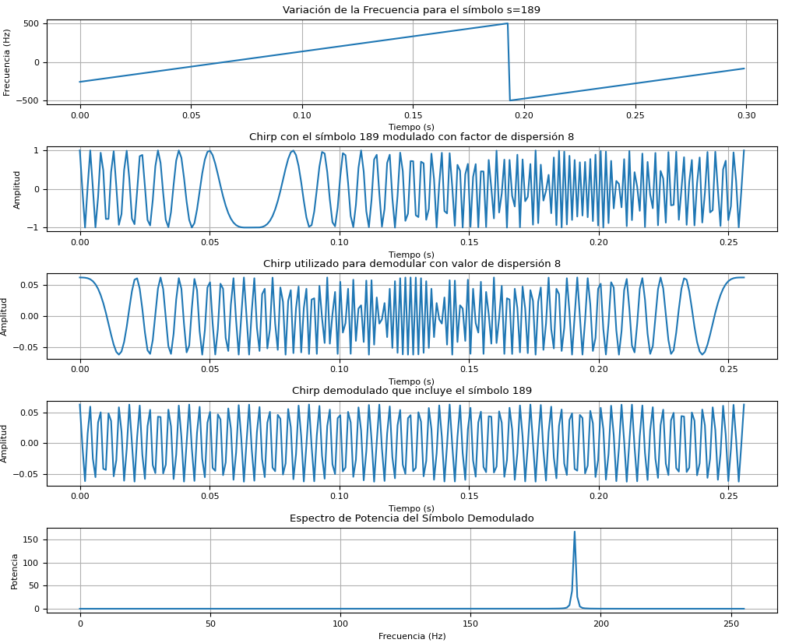

# Modulador y Demodulador LoRa
```markdown
## Descripción

El código define las características de la modulación LoRa, genera un símbolo específico, y luego lo modula y demodula. Finalmente, se visualizan diferentes aspectos de la señal modulada y demodulada.

## Requisitos

- Python 3.x
- numpy
- matplotlib

Puedes instalar las dependencias utilizando `pip`: 

```sh
pip install numpy matplotlib
```

## Uso

Clona este repositorio:

```sh
git clone https://github.com/tu_usuario/modulador_demodulador_LoRa.git
cd modulador_demodulador_LoRa
```

Ejecuta el script:

```sh
python modulador_demodulador_LoRa.py
```

El script generará varias gráficas que muestran la variación de la frecuencia, la amplitud del chirp modulado y demodulado, y el espectro de potencia del símbolo demodulado.



## [Explicación del Código](./explicacion_codigo.md)

- **Parámetros de Modulación**: Se definen el factor de dispersión (SF), el ancho de banda (BW), y la frecuencia de muestreo (Fs).
- **Generación de Símbolos**: La función `generar_symb` genera un chirp basado en el símbolo a transmitir.
- **Modulación y Demodulación**: Se modula el símbolo y se genera un chirp base para la demodulación.
- **Visualización**: Se crean varias gráficas para visualizar la variación de la frecuencia, la amplitud del chirp modulado y demodulado, y el espectro de potencia.

## Contribuciones

Las contribuciones son bienvenidas. Por favor, abre un issue o un pull request para discutir cualquier cambio que desees realizar.

## Licencia

Este proyecto está licenciado bajo la Licencia MIT. Consulta el archivo LICENSE para más detalles.

## Contacto

Para cualquier pregunta o sugerencia, por favor contacta a rommeljose@gmail.com

¡Gracias por usar este proyecto!
```
